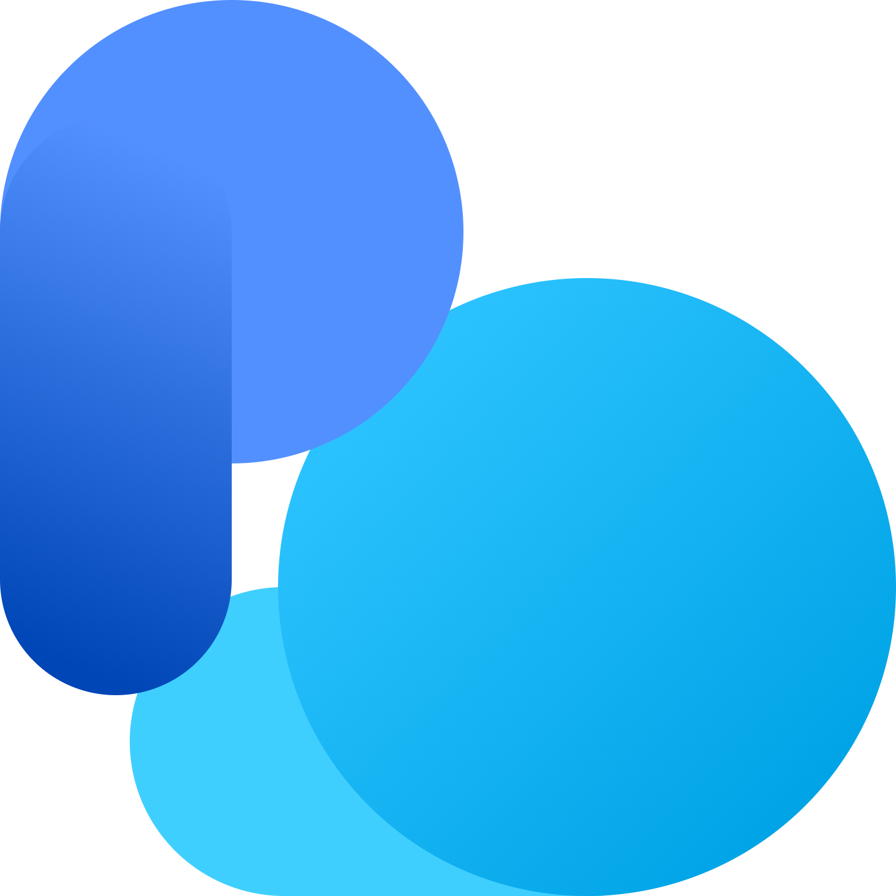
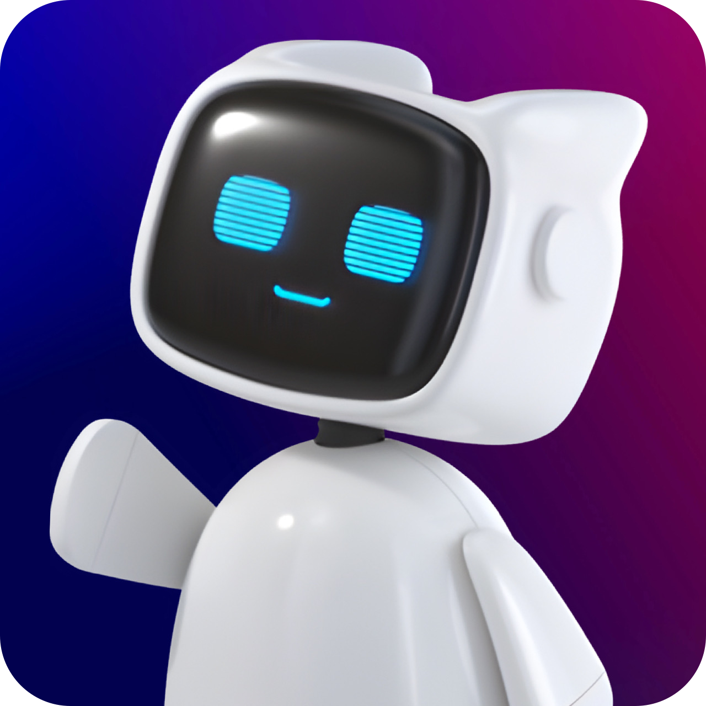
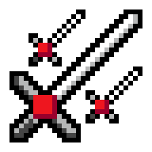

# ⚛ Who is Ruan, the Electron Juggler?

Hello World! 👋 I'm a Brazilian **software developer** and a lover of computer technology.

I am 18 years old, and I am in my third year of high school, in which I had the opportunity to take the **Digital World** elective offered by [Sistema Anglo de Ensino](https://www.sistemaanglo.com.br), as well as **Gamification** provided by [Escola Pestalozzi](https://www.pestalozzi.com.br). At the same time, I immersed myself in the studies of different programming languages, with the purpose of supplying the countless ideas of countless projects that I designed, whose purposes are mostly educational.

## 📘 Main projects

<table>
  <thead>
    <tr>
      <th>Platform</th>
      <th>Purpose</th>
    </tr>
  </thead>
  <tbody>
    <tr>
      <th>
        
      </th>
      <th>
        
Quasar is an educational application that provides an innovative study method, inspired by machine learning and the flow of a social network. Its function is to build an infinite collection of random solved questions from the main Brazilian entrance exams.
  
      </th>
    </tr>
    <tr>
      <th>
        
      </th>
      <th>
        
Projetus.cloud is a cloud computing platform, active on both servers and clients. Using WebSocket connections and a simple interface built with Flutter, it performs actions such as accessing, creating and removing files and folders from the target computer.
  
      </th>
    </tr>
    <tr>
      <th>
        
      </th>
      <th>
        
Pirilampo is an artificial intelligence bot for the Discord social network, capable of answering any student questions (using the ChatGPT API), directing access to virtual handouts and generating messages of random resolved questions.
 
      </th>
    </tr>
    <tr>
      <th>
        
      </th>
      <th>
        
Excalibur is an extension for the three-dimensional modeling program called Rhinoceros, which displays a graphical interface for defining object expansion parameters. This process is based on complex arithmetic progression calculations.
  
      </th>
    </tr>
  </tbody>
</table>

## 🚀 Personal skills

  
  
  
  
  
  
  
  
  
  
  
  
  
  
  
  

