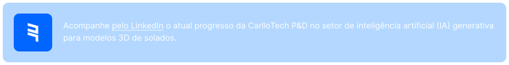
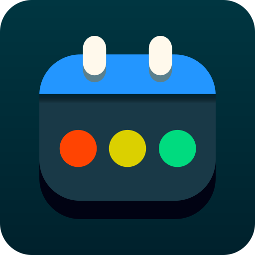
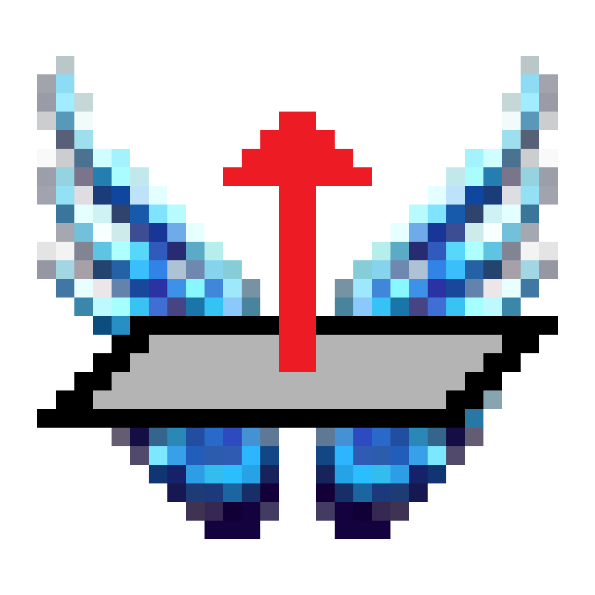

# ➥ Quem é Ruan?

**Olá, mundo!** Sou um desenvolvedor de _software_ brasileiro e empreendedor. Aprecio veemente o universo da tecnologia computacional, e busco a permanente atualização com as mais novas tecnologias e estudos da contemporaneidade.

Atualmente, tenho 20 anos de idade, e minha última experiência empresarial foi como como programador no [MeuCPD Soluções Tecnológicas](https://meucpd.com.br/), onde contribuía para projetos e, continuamente, aprimorava as minhas habilidades e competências adquiridas ao longo da minha formação.

Institucionalmente, fui aluno nos moldes do [Sistema Anglo de Ensino](https://www.sistemaanglo.com.br/) e da [Universidade Estadual Paulista (Unesp)](https://www2.unesp.br/), ambientes que, em conjunto com o Movimento Empresa Júnior do qual participei, inspiraram-me à abertura de uma startup independente, denominada [CarlloTech: Pesquisa & Desenvolvimento LTDA](https://carllotech.com/).

<a href="https://www.linkedin.com/company/carllotech" width="100%">
  <picture width="100%">
    <source media="(prefers-color-scheme: dark)" srcset="images/carllotech-info-dark.svg" width="100%">
    <source media="(prefers-color-scheme: light)" srcset="images/carllotech-info-light.svg" width="100%">
    
  </picture>
</a>

## 🚀 Ferramentas que utilizo

  
  
  
  
  
  
  
  
  
  
  
  
  
  
  
  
  
  
  
  
  
  
  
  
  
  
  

## 💡 Minhas competências

  <a href="#">Desenvolvimento multiplataforma</a> · <a href="#">Programação de plug-ins</a> · <a href="#">Construção de interfaces (UI/UX)</a> · <a href="#">Engenharia de microsserviços</a> · <a href="#">Sistemas de pagamento</a> · <a href="#">Aplicações web</a> · <a href="#">Produção de posts</a> · <a href="#">Edição e roteirização de vídeos</a> · <a href="#">Documentação de projetos</a>

## 📘 Projetos pessoais

<table>
  <thead>
    <tr>
      <th>Aplicação</th>
      <th>Descrição</th>
    </tr>
  </thead>
  <tbody>
  <tr>
      <th>
        
      </th>
      <th>
        
Semaphore é uma aplicação para fins empresariais, que permite a organização e categorização de serviços em uma interface elegante e de fácil navegação. Utiliza, como base de dados, a leitura e escrita de arquivos JSON armazenados no disco de cada um dos sistemas operacionais suportados.
  
      </th>
    </tr>
    <tr>
      <th>
        
      </th>
      <th>
        
Quasar é um aplicativo educacional que fornece um método de estudo inovador, inspirado na ideia central do machine learning e no fluxo das redes sociais. Sua função é listar uma coleção infinita e randômica de questões resolvidas dos principais vestibulares brasileiros.
  
      </th>
    </tr>
    <tr>
      <th>
        
      </th>
      <th>
        
Projetus.cloud é uma plataforma de computação em nuvem, que permite transformar qualquer dispositivo, como um pequeno Raspberry Pi, em um servidor. Usando conexões WebSocket e uma interface simples construída com Flutter, executa ações como acessar, criar e remover arquivos.
  
      </th>
    </tr>
    <tr>
      <th>
        
      </th>
      <th>
        
Pirilampo é um bot de inteligência artificial para a rede social Discord, capaz de responder a quaisquer perguntas dos alunos (usando a API ChatGPT), de direcionar o acesso a apostilas virtuais e gerar imagens aleatórias de questões resolvidas de provas.
 
      </th>
    </tr>
    <tr>
      <th>
        
      </th>
      <th>
        
Excalibur é uma extensão para um programa de modelagem tridimensional chamado Rhinoceros, que exibe uma interface gráfica para definir parâmetros de escalamento de objetos, como por exemplo modelos de sapatos. Esse processo é baseado em complexos cálculos de progressão aritmética.
  
      </th>
    </tr>
    <tr>
      <th>
        
      </th>
      <th>
        
Winder é outro plug-in para Rhinoceros arquitetado para realiazar o flip de superfícias fantasmas de sólidos tridimensionais com aberturas. Faz uso de conceitos de Cálculo Diferencial e Integral para computar aproximações de superfícies e reorientar seus vetores normais.
  
      </th>
    </tr>
  </tbody>
</table>
